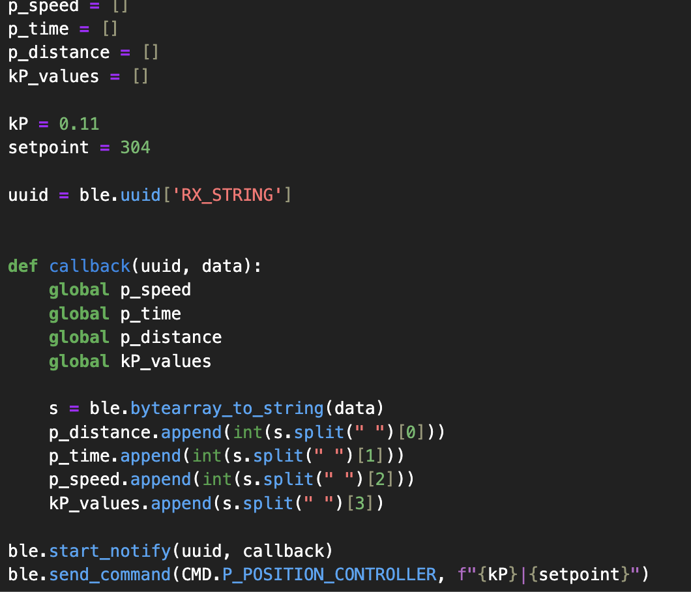
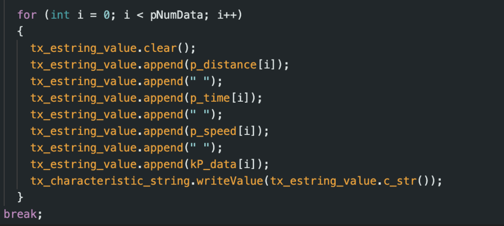
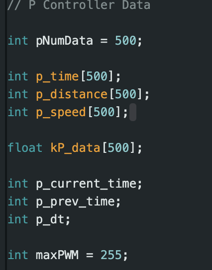
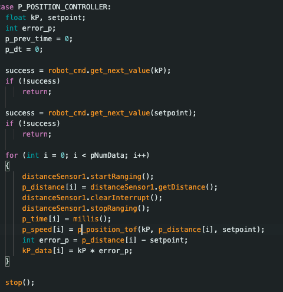
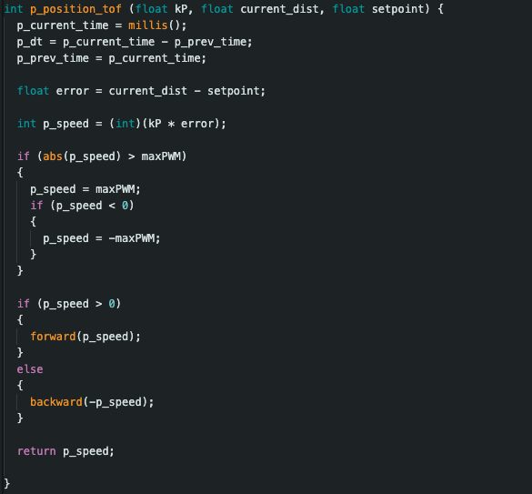
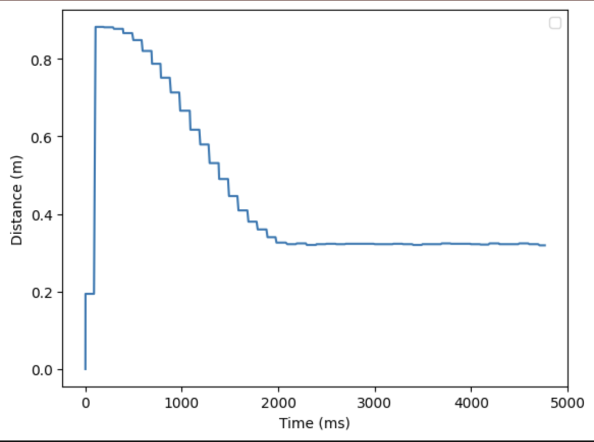
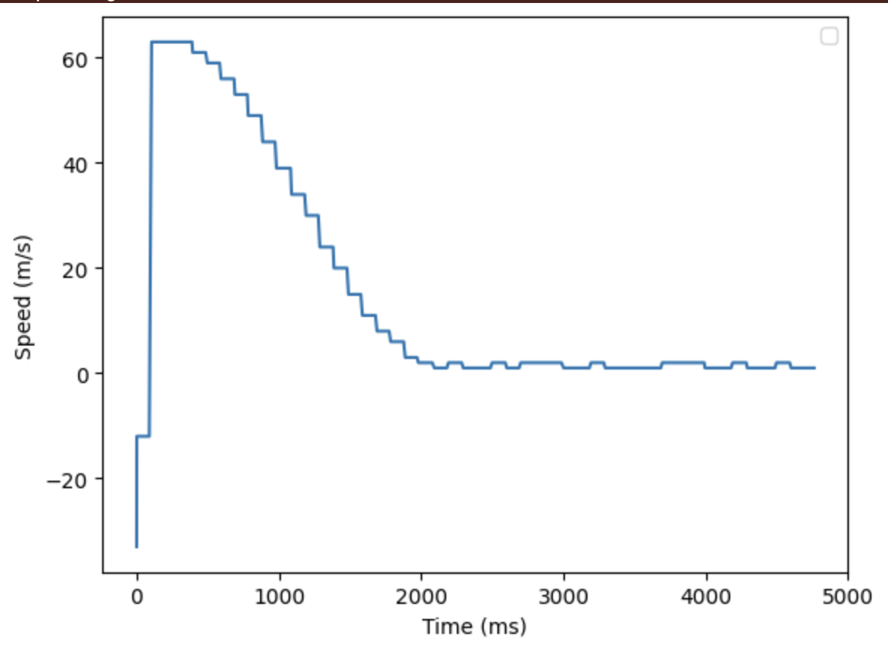

# Lab 5
{: .fs-9 }

The purpose of this lab was to implement linear PID control for the car moving in a straight line. 

# Pre-Lab
{: .fs-7 }

# Bluetooth
{: .fs-5 }

In order to send data from the Arduino on the car to the Jupyter python library for data post-processing, I employed a similar method to what I did in Labs 2 and 3 for the IMU and TOF sensors. As you can see from the code below, I sent data over by creating a BLE command and then using the BLE String characteristic to send all the different data. The code below also shows how I sent the kP gain and setpoint over to the Arduino to be ran by the 'P_POSITION_CONTROLLER' command. 

After running the command from the notification handler and receiving the data, I processed the data by graphing the motor output and distance from the TOF sensor over the time, which can be seen in the code snippets below.

On the Arduino end, as I explained before, I used the BLE String characteristic service to write the value of the four arrays I want to be sent to the Jupyter noteook, which can be seen in the code below.

# Lab Tasks
{: .fs-7 }

# P/I/D Discussion
{: .fs-5 }

Of the different controllers in this Lab to choose from, I decided to go with just a simple P controller for ease of implementation. 

Given a simple P controller, the equation for the motor output will be as follows:

speed = kP * error

The proportional gain kP adjusts the current error or the difference between the setpoint and current distance value in proportion to its magnitude. A higher kP value would be a larger error correction, which may lead to overshooting. However, a kP value that is too small would lead to the car stopping before it reached the setpoint.

Since I'm only using a P controller in this lab. There are many limitations for what the car is able to do. For example, since I'm only using a P controller, the car will be less adaptable and consistent, meaning any change in the starting position from the wall or floor material may cause significant changes in the result. 

From a range of motor values from 30 to 255, where 30 is the minimum PWM output to cause the car to move linearly on the floor and 255 is the maxmimum PWM value, and the TOF range of 4000mm. We can estimate that the kP value should be around 255/4000 or .06. Given this starting estimate, I began with this an iterated and tested the car while slightly altering the kP value until I reached the goal result. The final kP value I ended up at was 0.11, which is pretty close to the initial estimate of .06.

# Range/Sampling Time Discussion
{: .fs-5 }

The range I chose for the TOF sensor was the long range in order to ensure that the car would be able to sense the wall from as far as possible. However, this will result in a lower sampling frequency when compared with the short or medium range sensors. In the code, I ensured that getting data from the sensor would not cause a block in the code by not checking if the data was ready. This means that the code will complete whether or not the data is ready. If the data is ready, then it will use the updated data otherwise it will use the old data. This is further elaborated on in the Extrapolation section.

# P Controller Implementation
{: .fs-5 }

My implementation of the P controller is shown in the below code:

First, below is the data necessary to run the controller as well the arrays of size 500 to be sent for data processing.

Next, we have the command that is called in order to start the controller and to collect and send data.

The command invokes the following method used for calculating and writing the motor driver output for a P controller:

# Results
{: .fs-5 }

Below is a video of the P controller working to reach the goal setpoint:

Below are the graphs of the PWM motor output/speed and distance from the wall over time corresponding to the above video.

In the graphs, we see that the distances from the wall change discretely, meaning that there is a significant difference between the frequency of the long range TOF sensor and the overall PID loop, which is why we need extrapolation.

# Extrapolation
{: .fs-5 }

From the data received above from the P controller test, we get that the frequency of the overall P loop is around 106 Hz whereas the TOF sensor frequency is roughly 8 times less than that at 13 Hz. The TOF sensor is 8 times less because after inspecting the TOF data, I noticed that only after around 8 timesteps does the TOF update to a new value. The calculation for these frequencies are below:

After finding the frequencies of the main P loop and the TOF sensor, I then implemented a linear extrapolation algorithm to allow for the Arduino to estimate the next possible TOF data using the most recent previously gotten TOF data. The code for this is below:

